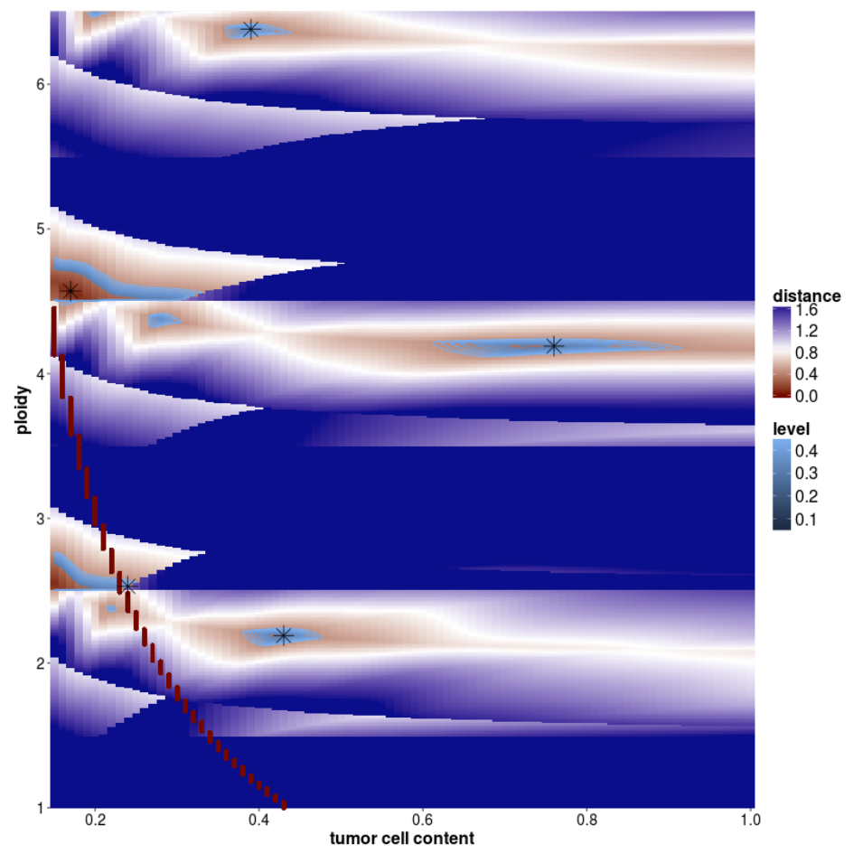

[< previous](sv.md)  |  [home](README.md)  |  [next >](rnaseq.md) 

# ACEseq CNA workflow
- https://github.com/DKFZ-ODCF/ACEseqWorkflow
- https://aceseq.readthedocs.io/en/latest/
- https://www.biorxiv.org/content/10.1101/210807v1.full

## Somatic calling
- ACEseq models allele specific copy numbers
- An exahusive search of combinations of purity and ploidy are performed.
    - visualised in the star plot , with the best model reported with a star: `*_tcn_distances_combined_star.png` 
    - the godness of fit for best hits reported in: `*_ploidy_purity_2D.txt`
- A TSV file of the solution reported: `*_most_important_info{est_ploid}_{est_purity}.txt`
- Plots of the solution are also reported: `*_plot_*_*_ALL.png`
- The lower bound of tumor purity that can be identified is 15% (parametisable)
    - **if the estimated purity is below 15%, ACEseq reports the purity as 100%**

## The `most_important` CNA file

- The columns in the ACEseq `most important file`:
    - 1:chromosome
    - 2:start
    - 3:end
    - 4:length - length of segment
    - 5:covRatio - coverage ratio of tum:control
    - 6:TCN - estimated total copy number of the segment
    - 7:SV.Type - annotation of the SV overlaping the segment border - IGNORE!
    - 8:c1Mean - minor allele copy number
    - 9:c2Mean - major allele copy number
    - 10:dhEst - raw decrease in heterozygosity estimated
    - 11:dhSNPs - 
    - 12:genotype - ratio of rounded allele copy numbers
    - 13:CNA.type - DUP/DEL/LOH/TCNneutral/HomoDel 
    - 14:NbrOfHetsSNPs - number of control heterozygous SNPs in segment (**if this is below 5 it is not trustworthy**)
    - 15:minStart - last SNP prior to segment start
    - 16:maxStart - first SNP after segment start
    - 17:minStop - last SNP prior to segment end
    - 18:maxStop - first SNP after segment end

## Reviewing CNV QC QC via OTP
Most of the useful information required to evaluate the CNA results is available via the OTP top menu -> results -> CNV results
- raw coverage counts per 1 kb window. This provides alot of insite into the general quality and purity of samples. A high quality sample has a tight coverage distribution, and high purity samples have very distinct coverage shifts. Examples of bad coverage uniformity:  ... and low purity: 

- coverage stratified by GC content (and correction)
- coverage stratified by replication timing (and corrected)
     
## Known issues
- Very low purity samples are often reported as 100% pure
- Diploid solutions often have tetraploid and hexaploid solutions
- Homodels are reported in regions with very few SNPs, e.g. in PSG gene clusters. You should be dubious of any reports of homoDels that have less than 10 `NbrOfHetsSNPs` in a segment
- Some samples have elevated (sub)telomeric coverage in the control samples. This creates a false positive deletion in tumors 

# Tasks

1. Go to a folder containing the ACEseq CNV calls of a sample
2. Check how many copy number solutions were estimated: `cat *_ploidy_purity_2D.txt`
3. Check if any homozygous deletions exist: `grep HomoDel *most_important* | wc -l`
 - do they have more than 5 heterozygous SNPs supporting them? `grep HomoDel *most*grep HomoDel *most_important* | awk '$14>5' | wc -l`
4. Check the CNV plots of a sample on OTP:
 - do any samples show GC or replication timing bias?
 - evaluate the plausbility of the ACEseq solution plot (last pages of the PDF)

[< previous](sv.md)  |  [home](README.md)  |  [next >](rnaseq.md) 
