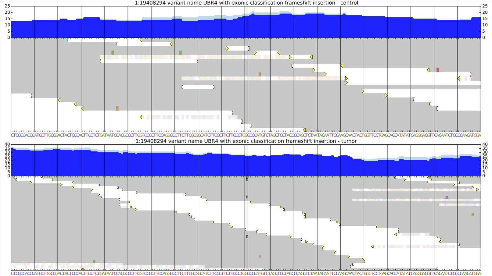
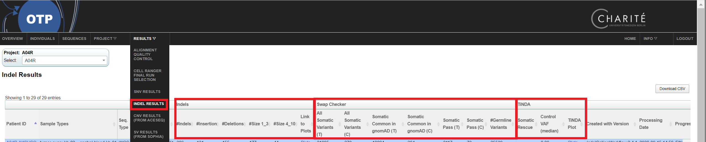
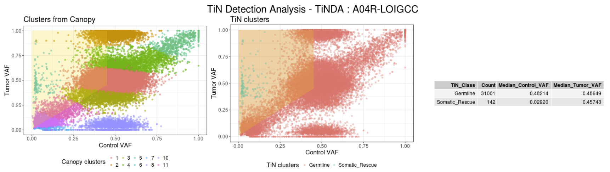

[< previous](snv.md)  |  [home](README.md)  |  [next >](sv.md) 

# Insertion and Deletion calling workflow
- https://github.com/DKFZ-ODCF/IndelCallingWorkflow

## Somatic calling
- platypus is used to call indels (tumor and control at the same time)
    - `indel_A01P-ZOMNON.vcf.raw.gz`
- each SNV is assigned a "confidence", starting at 10
- mutations lying on "problematic regions" (e.g. read attracting, black lister region, STRss) are punished, and confidence is reduced
- mutations are classified as germline if >=1 (2?) reads are found in the control
- each indel is annotated for coding effect
- each indel is annotated to belong to a certain region (e.g. CpGI, enhancer, miRNA, repeat...)
    - `indel_A01P-ZOMNON.vcf.gz`
- all remaining mutations with confidence >=8 are considered as somatic candidates, and filtered as subsets
    - `indel_A01P-ZOMNON_somatic_indels_conf_8_to_10.vcf`    - 
    - `indel_A01P-ZOMNON_somatic_functional_indels_conf_8_to_10.vcf`
    - `indel_A01P-ZOMNON_germline_functional_indels_conf_8_to_10.vcf`
    - `indel_A01P-ZOMNON_somatic_ncRNA_indels_conf_8_to_10.vcf`

## Deep annotation of indels

- The VCF files produced by the indels workflow are not conformant with the VCF 4.0 standard
- The contain additional columns, which we refer to as "deep annotation" (which should be encoded in the INFO field, but use append them as tab separated columns)
    - 1:CHROM
    - 2:POS
    - 3:ID
    - 4:REF
    - 5:ALT
    - 6:QUAL
    - 7:FILTER
    - 8:INFO
    - 9:FORMAT
    - 10:CONTROL
    - 11:TUMOR
    - 12:DBSNP
    - 13:1K_GENOMES
    - 14:ExAC
    - 15:EVS
    - 16:GNOMAD_EXOMES
    - 17:GNOMAD_GENOMES
    - 18:LocalControlAF
    - 19:**ANNOVAR_FUNCTION**
    - 20:**GENE**
    - 21:**EXONIC_CLASSIFICATION**
    - 22:ANNOVAR_TRANSCRIPTS
    - 23:SEGDUP
    - 24:CYTOBAND
    - 25:REPEAT_MASKER
    - 26:DAC_BLACKLIST
    - 27:DUKE_EXCLUDED
    - 28:HISEQDEPTH
    - 29:SELFCHAIN
    - 30:MAPABILITY
    - 31:SIMPLE_TANDEMREPEATS
    - 32:**CLASSIFICATION**
    - 33:**CONFIDENCE**
    - 34:REGION_CONFIDENCE
    - 35:Enhancers
    - 36:CpGislands
    - 37:TFBScons
    - 38:ENCODE_DNASE
    - 39:miRNAs_snoRNAs
    - 40:miRBase18
    - 41:COSMIC
    - 42:miRNAtargets
    - 43:CgiMountains
    - 44:phastConsElem20bp
    - 45:ENCODE_TFBS
    
## SNV calling using platypus
- SNV calls are also available from the platypus workflow
   - `snvs_A01P-ZOMNON.GTfiltered_gnomAD.Germline.Rare.vcf`
   - `snvs_A01P-ZOMNON.GTfiltered_gnomAD.SomaticIn.vcf`

## Rescued mutations
- Sometimes sommatic mutations can be missclassified as germline if there is tumor DNA present in the control
- Based of MAF modelling, these can be rescued:
   - `grep -w Somatic_Rescue snvs_A01P-ZOMNON.GTfiltered_gnomAD.Germline.Rare.vcf`
    
## IGV like screenshots
- Since indels are typically harder to call than SNVs, we typically review them by eye using IGV
- Using IGV to validate many events is tedious!
- Screenshots of each functional indel are produced and saved in a PDF file:

## OTP QC
- OTP top menu -> results -> indel results

- General overview per sample, including 
   - size breakdown, and link to IGV like plots
   - tumor-normal swap check: by calling mutations in control vs tumor, we can see if the tumor has been switched with the control (assuming that the control will have fewer mutations)
   - tumor-in-normal-detection-algorithm (TiNDA)
   

# Tasks

1. Go to a folder containing the indel calls of a sample
2. Check if a known cancer gene is mutated: `cut -f 19-21 indel_*_indels_conf_8_to_10.vcf | grep -w 'TP53\|KRAS\|CDKN2A\|EGFR\|PI3KCA\|BRCA1\|BRCA2\|PTEN\|APC\|ARID1A' `
3. Check what type of protein coding effects are found in the sample: `cut -f 21 indel_*_indels_conf_8_to_10.vcf | sort | uniq -c`
4. Check if any gerline mutations are found in COSMIC: `cut -f 19-21,41 indel_*_germline_functional_indels_conf_8_to_10.vcf | grep basechange`

[< previous](snv.md)  |  [home](README.md)  |  [next >](sv.md) 
