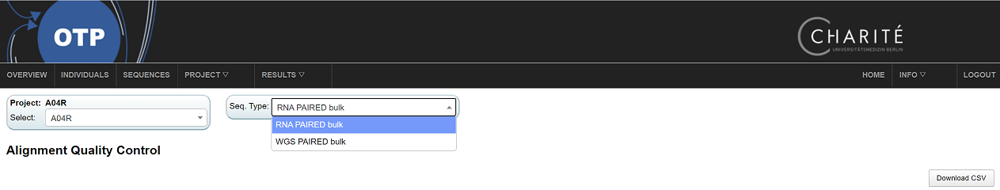
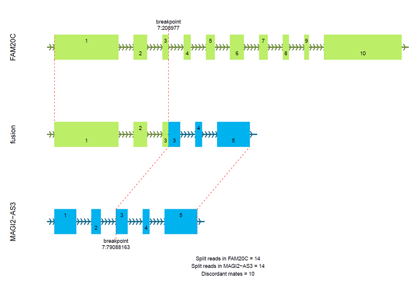

[< previous](cna.md)  |  [home](README.md) 

# RNAseq workflow

- https://github.com/DKFZ-ODCF/RNAseqWorkflow
- support single nd paired end reads
- steps:
    - alignment using STAR (2 pass per sample, with adapter trimming): `alignment/*_$patientID_merged.mdup.bam` and `alignment/*_$patientID_chimeric_merged.junction`
    - mark duplicates (not removed) using sambamba
    - finger printing (checking 1000 polymorphic positions)
    - RNAseQC
    - Qualimap (optional)
    - read counting using featurecounts
    - FPKM and TPM calculation
         - These calculations are optimised for removing outlier expression (i.e. problematic genes are removed from the library size calculation)
    - Exon-part level counting using featurecounts (experimental)
    - alignment free gene expression quantification using kallisto (optional)
    - fusion detection using arriba
    
## RNAseq results for PeDiOn
- current PeDiOn RNAseq results are based on Illumina TruSeq Nano Total RNA library preparation kit
     - this reports all RNA (!) in a strand specific manner
     - however, there are some quality issues associated with this kit
- gene expression quantification in the `featureCounts` directory:
    - 1:chrom
    - 2:chromStart
    - 3:chromEnd
    - 4:gene_id
    - 5:score
    - 6:strand
    - 7:name
    - 8:exonic_length
    - 9:num_reads
    - 10:num_reads_fw - number of reads on forward strand
    - 11:num_reads_rv - number of reads on reverse strand
    - 12:FPKM - this is an 'improved' FPKM calculation (better than canonical TPM)
    - 13:FPKM_fw
    - 14:FPKM_rv
    - 15:TPM - this is an 'improved' TPM calculation (better than canonical TPM)
    - 16:TPM_fw
    - 17:TPM_rv
    - 18:FPKM_legacy - this is the canonical FPKM calculation
    - 19:FPKM_legacy_fw
    - 20:FPKM_legacy_rv
    - 21:TPM_legacy - this is the canonical TPM calculation
    - 22:TPM_legacy_fw
    - 23:TPM_legacy_rv

# Tasks
1. Review RNAseq alignment quality on OTP (OTP top menu -> alingment quality control -> select RNA bulk from the "Seq. Type" drop down menu)

2. Find a RNAseq sample on the file system for your project
 - `data/analysis/pedion/A04R/user_folders/ishaquen/test_analysis_structure/rna_sequencing/results_per_pid/`
3. Review the QC of the sample
4. Check the gene expression quantification in the `featurecounts` folder. Can you identify if the sequencing library was strand specific? If so, which direction?
5. Check the  `fusions_arriba` directory
 - example of a fusion report by arriba

[< previous](cna.md)  |  [home](README.md)  

