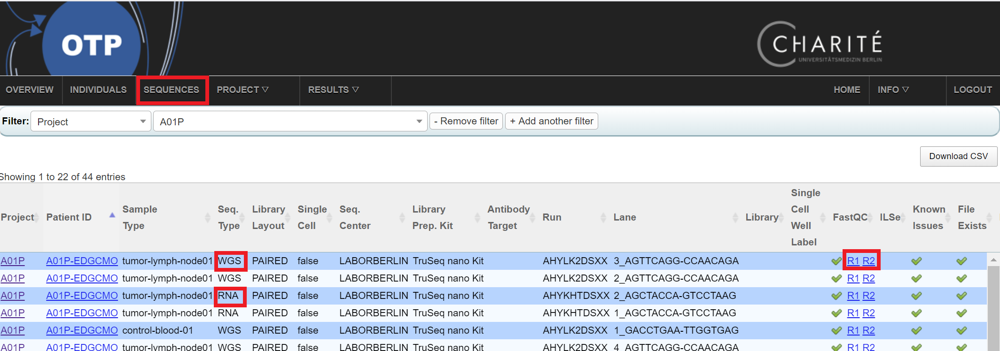

[< previous](analysis-structure.md)  |  [home](README.md)  |  [next >](workflows.md) 

# Sample Quality Control

## Sequence level QC
- Typically performed by genomics core facility
- FASTQC results are available in the OTP web interface
    - OTP top menu -> Sequences
    - Click the links to the FASTQC reports
    
- FASTQC results are available on the file system
     - `ls /data/otp/project/pedion/*/sequencing/*_sequencing/view-by-pid/*/*/paired/run*/fastx_qc/`
     
There are QC aspects spread over different workflows - they will be addressed in various sections.
    
# TASKS

1. Evaluate the QC of read 1 and read 2 for a sample in your study. Look into a WGS and RNAseq sample if avaialbe.

[< previous](analysis-structure.md)  |  [home](README.md)  |  [next >](workflows.md) 
