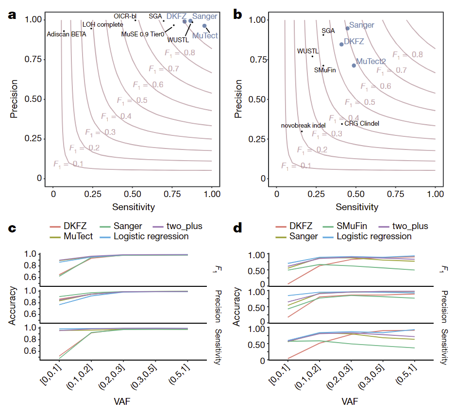
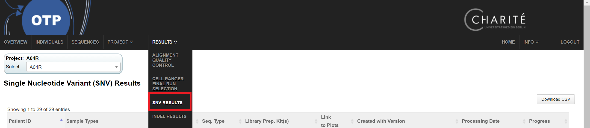
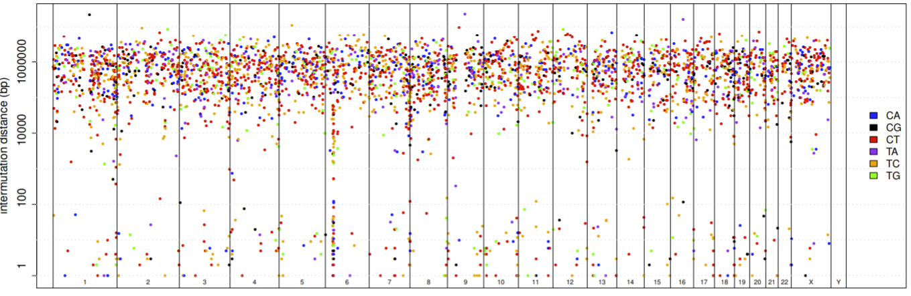
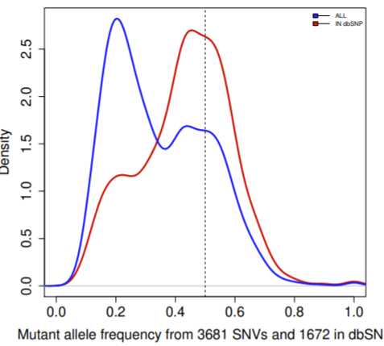
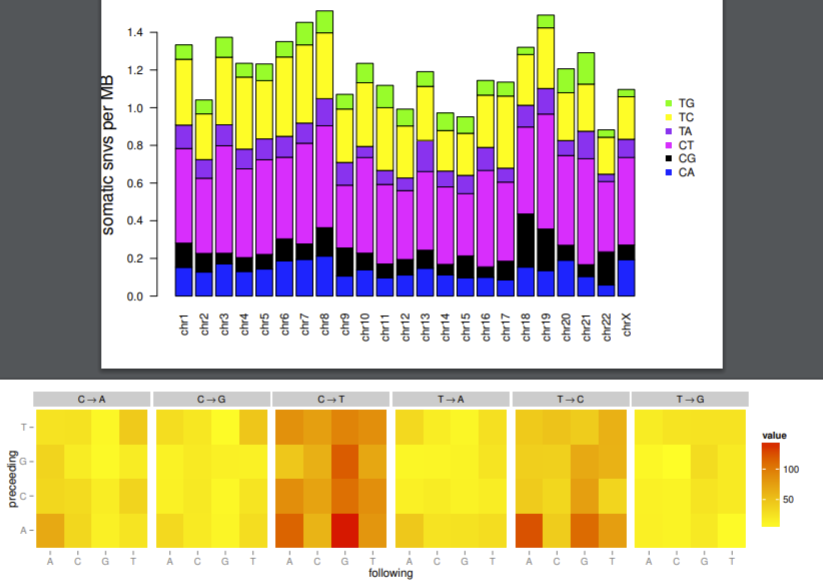
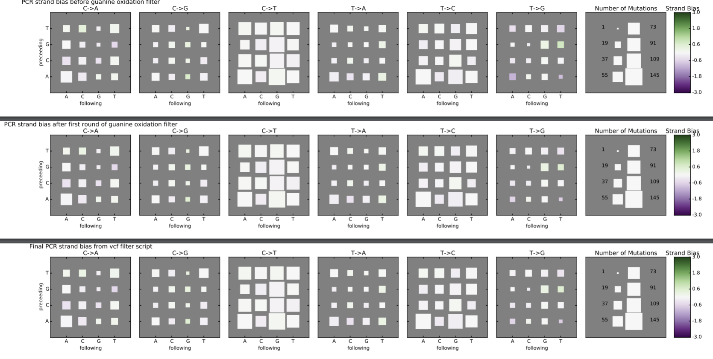
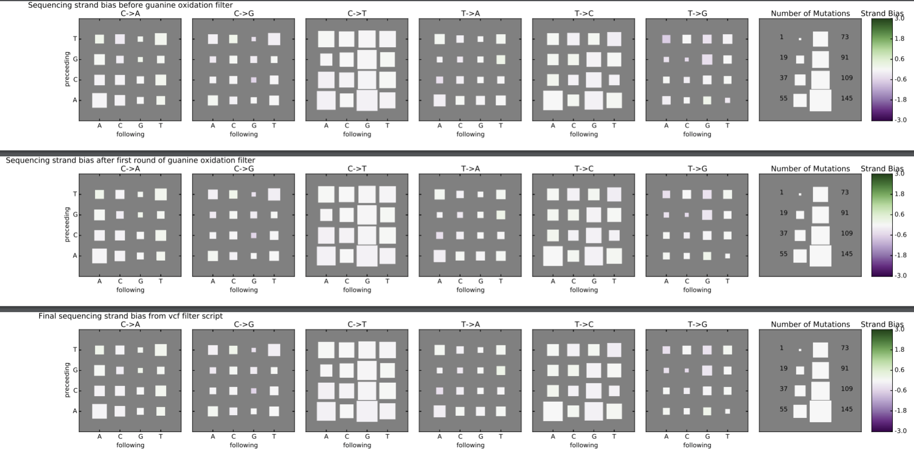

[< previous](alignment.md)  |  [home](README.md)  |  [next >](indel.md) 

# SNV workflow
- https://github.com/DKFZ-ODCF/SNVCallingWorkflow
- https://dockstore.org/containers/quay.io/pancancer/pcawg-dkfz-workflow:2.2.0?tab=info

## Performance

> Validation of variant-calling pipelines in PCAWG. a, Scatter plot of estimated sensitivity and precision for somatic SNVs across individual algorithms assessed in the validation exercise across n = 63 PCAWG samples. Core algorithms included in the final PCAWG call set are shown in blue.  b, Sensitivity and precision estimates across individual algorithms for somatic indels. c, Accuracy (precision, sensitivity and F1 score, defined as 2 × sensitivity × precision/(sensitivity + precision)) of somatic SNV calls across variant allele fractions (VAFs) for the core algorithms. The accuracy of two methods of combining variant calls (two-plus, which was used in the final dataset, and logistic regression) is also shown. d, Accuracy of indel calls across variant allele fractions.
Campbell, P.J., Getz, G., Korbel, J.O. et al. Pan-cancer analysis of whole genomes. Nature 578, 82–93 (2020). https://doi.org/10.1038/s41586-020-1969-6

## Somatic calling
- mpileup is used with high sensetivity in tumor and control
- each SNV is assigned a "confidence", starting at 10
- mutations lying on "problematic regions" (e.g. read attracting, black lister region, STRss) are punished, and confidence is reduced
- mutations are classified as germline if >=2 (3?) reads are found in the control
- all remaining mutations with confidence >=8 are considered as somatic candidates
    - annotated using annovar based on gencode19 gene models
    - filtered into subsets of lists

## OTP QC
- OTP top menu -> results -> SNV results

- General overview per sample, including `plots`
     - **Rainfall plots**/ intermutational distance plots: somatic hyper mutation (SHM), kataegis events
     
     
     - **MAF** of somatic mutations (all in red, blue in dbSNP)
     
     
     - **Mutational pattern** by chromosome and mutation triplet context
     
     
     - **Strand bias - PCR strand**
     
         
     - **Strand bias - sequencing strand**
     
       

[< previous](alignment.md)  |  [home](README.md)  |  [next >](indel.md) 
