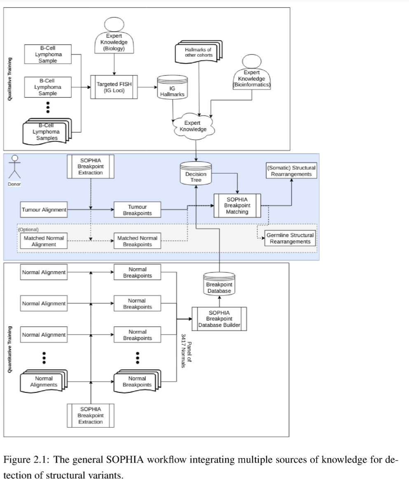

[< previous](indel.md)  |  [home](README.md)  |  [next >](cna.md) 

# SV workflow
- https://github.com/DKFZ-ODCF/SophiaWorkflow
- https://bitbucket.org/utoprak/sophia/src
- Based on the unpublished Sophia tool (Umut Toprak @DKFZ)
     - [Umuts PhD thesis describes Sophia p. 48-103](http://archiv.ub.uni-heidelberg.de/volltextserver/27429/1/Integrative%20Analysis%20of%20Omics%20Datasets%20-%20Umut%20Toprak%2C%202019.pdf)
     
     
## Performance
- highly CPU and memory efficient: results comparable to Delly in a 2-4 hours on a single core     

## Somatic calling
- each break point based on soft clipped reads is identified in both control and tumor: `control-*_bps.tsv.gz` and `tumor-*_bps.tsv.gz`
- somatic SVs are called, deduplicated, with further germline filtering applied based on a background normal cohort of >3000 samples: `svs_*_filtered_dedup_somatic.tsv`
- each SV is scored based on an event score (see thesis section "2.2.6 Filtering Criteria for Structural Variant Candidates"), with eventScore >3 being the preferred filter: `svs_*_filtered_somatic_minEventScore3.tsv`

## Annotation of SVs
- The TSV output of sophia contain numerous columns, separating the annotation of breakpoint 1 and breakpoint 2 (an SV has 2 coordinates!):
    - 1:chrom1
    - 2:start1
    - 3:end1
    - 4:chrom2
    - 5:start2
    - 6:end2
    - 7:somaticity1
    - 8:somaticity2
    - 9:svtype
    - 10:eventScore
    - 11:eventSize
    - 12:eventInversion
    - 13:evidence1
    - 14:clonalityRatio1
    - 15:evidence2
    - 16:clonalityRatio2
    - 17:source1
    - 18:source2
    - 19:overhang1
    - 20:overhang2
    - **21:gene1** - direct gene hit obn break point 1
    - **22:cancerGene1** - direct cancer gene hit obn break point 1
    - 23:nearestCodingGeneUpstream1
    - 24:nearestCodingGeneUpstreamDistance1
    - 25:nearestCancerGeneUpstream1
    - 26:nearestCancerGeneUpstreamDistance1
    - 27:nearestCodingGeneDownstream1
    - 28:nearestCodingGeneDownstreamDistance1
    - 29:nearestCancerGeneDownstream1
    - 30:nearestCancerGeneDownstreamDistance1
    - **31:gene2** - direct gene hit obn break point 2
    - **32:cancerGene2** - direct cancer gene hit obn break point 2
    - 33:nearestCodingGeneUpstream2
    - 34:nearestCodingGeneUpstreamDistance2
    - 35:nearestCancerGeneUpstream2
    - 36:nearestCancerGeneUpstreamDistance2
    - 37:nearestCodingGeneDownstream2
    - 38:nearestCodingGeneDownstreamDistance2
    - 39:nearestCancerGeneDownstream2
    - 40:nearestCancerGeneDownstreamDistance2
    - 41:dbSUPERenhancer1
    - 42:dbSUPERenhancer2
    - 43:rescuedEnhancerHitCandidate
    - 44:TADindices
    - 45:affectedGenesTADestimate
    - 46:affectedCancerGenesTADestimate
    - 47:chrom1PreDecoyRemap
    - 48:start1PreDecoyRemap
    - 49:end1PreDecoyRemap
    - 50:chrom2PreDecoyRemap
    - 51:start2PreDecoyRemap
    - 52:end2PreDecoyRemap
    - 53:directFusionCandidates
    - 54:directFusionCandidatesBothCancer
    - 55:indirectFusionCandidatesLeftCancerRightAny
    - 56:indirectFusionCandidatesRightCancerLeftAny
    - 57:indirectFusionCandidatesAny

## OTP QC
- OTP top menu -> results -> SV results
- General overview of QC focuses on RNA contamination in DNA. This is not an issue since Illumina introduced dual indexing, so nothing interesting to show
     
# Tasks

1. Go to a folder containing the SV calls of a sample
2. Check if a known cancer gene is hit: `cut -f 21-40 svs_*_filtered_somatic_minEventScore3.tsv | grep -w 'TP53\|KRAS\|CDKN2A\|EGFR\|PI3KCA\|BRCA1\|BRCA2\|PTEN\|APC\|ARID1A' `
3. Chaeck for DNA fusions of genes: `cut -f 53  svs_*_filtered_somatic_minEventScore3.tsv | sort -u`
4. Check if any SV is annoted to a super enhancer for putative super enahncer hijacking: `cut -f 1-6,21,31,41,42  svs_*_filtered_somatic_minEventScore3.tsv | grep SE_`

[< previous](indel.md)  |  [home](README.md)  |  [next >](cna.md) 
